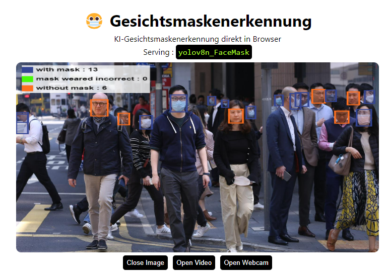

# Face Mask detection using YOLOv8
# KI-Gesichtsmaskenerkennung

<p align="center">
  
</p>

**KI-Gesichtsmaskenerkennung direkt in Browser:**
https://miaoima.github.io/FaceMaskDetection/
---

Dies ist eine Gesichtsmaskenerkennungsanwendung, die direkt in Ihrem Browser unter Verwendung des webgl Backends läuft.

**Model**

Verwendetes Modell ist das in tensorflow.js konvertierte YOLOv8n_FaceMask Modell.

Durch das Modell kann erkannt werden, ob Personen auf Bildern oder in Videos eine Maske tragen und ob die Maske korrekt getragen wird. 
Zudem kann die entsprechende Anzahl erfasst werden.

##Einrichtung

```shell
git clone https://github.com/Hyuto/yolov8-tfjs.git
cd yolov8-tfjs
yarn install #Install dependencies
```

##Skripte

```shell
yarn start # Start dev server
yarn build # Build for productions
```

## Reference

- https://github.com/ultralytics/ultralytics
- https://github.com/Hyuto/yolov8-onnxruntime-web
